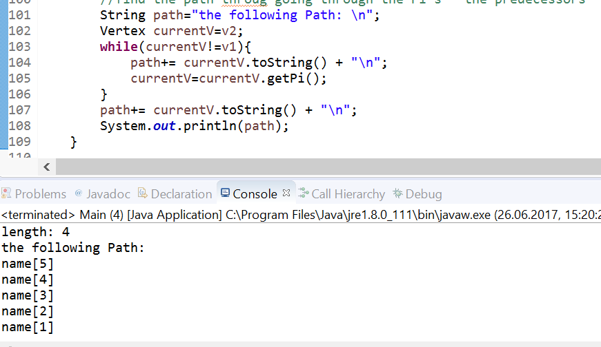
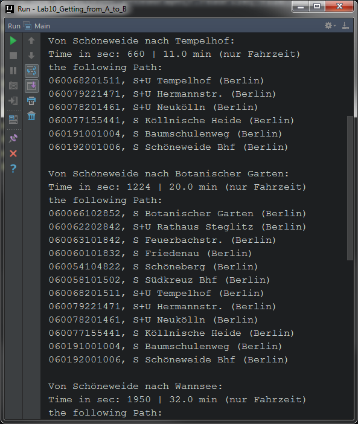

# Lab Report - Exercise 10: Getting from A to B
_Authors: Dennis Loska, Bernhard Zaborniak, Tony Dorfmeister, 20.06.2017_
<!--  PRELAB not requiered -->
## Assignment

## 1. Design and implement a data type WeightedGraph that uses either an adjacency list or an adjacency matrix. How are you going to store the weights?

Wir sind dem Beispiel von Alexander gefolgt, die Weights haben wir als Parameter der Edges-klasse gespiechert. Unser Interface sieht so aus:

```Java
public interface DirectedWeightedGraphInterface {
	public void generateWeightedGraph();
	public Edge getEdge(Vertex src, Vertex sink);
	public Vertex getVertex(String name);
	public ArrayList<Vertex> getNeighbors(Vertex aVertex);
}

```

## 2. While one partner is doing this, the other one should write a class that reads a graph from a file. See notes on the file format and the example file below!

Die Syntax  source firstDesinationNode,weightTithis secondDestination,weight  ...und so weiter lasen wir in unserem Programm mit dem String Tokenizer in der Mainmethode ein. Um das einlesen hat sich eine seperate Klasse gekümmert- der eingelesene String wird dann dem Graphen-Konstruktor als Parameter übergeben. Beim Erstellen des Graphen wird er basierend auf der Textdatei erstellt. Mit der richtigen Syntax funktionierte dies gut beim Testen.

```Java
DirectedWeightedGraph g2 = new DirectedWeightedGraph(r.readFile("file.txt"));
  //...
public DirectedWeightedGraph(String fileGraph) {
    this.fileGraph = fileGraph;
    vertices = new ArrayList<Vertex>();
    edges = new ArrayList<Edge>();
    generateWeightedGraph();
}

```
```Java

public String readFile(String filename) {
    String result = "";
    String currentLine;
    try {
        BufferedReader br = new BufferedReader(new FileReader(filename));
        while ((currentLine = br.readLine()) != null) {
            result += currentLine + "\n";
        }
        br.close();
    } catch (Exception e) {
        e.printStackTrace();
        System.out.println("sth went wrong");
    }
    return result;
}

```

## 3. Now write a method that will take a graph and two vertices and find the shortest path between the vertices. Make a method to print out the path in a readable format. What class will these methods belong to?

### Depth First Search-Algorithmus

Da wir zuerst den Dijkstra-Algorithmus implementiert haben, haben wir uns an diesem orientiert und auf Basis dessen den Depth First Search-Algorithmus in der depthFirstSearch()-Methode erstellt. Es wurde ein Stack verwendet, um die besuchten Nodes darin zu speichern. Jede aktuelle Node sucht sich den ersten beliebigen Nachbarn und so weiter. Wenn keine Nachbarn vorhanden sind bzw. es keinen weiteren Weg gibt, geht der Algorithmus wieder zu der Node zurück, die noch nicht alle Nachbarn besucht hatte. Dies geht solange, bis das gesuchte Node gefunden wurde.


## 4. Meanwhile, your partner writes a method that takes a graph, picks two vertices at random, and finds the cheapest path between the two.

### Dijkstra-algorithmus

Der Djkstra Algorithmus ist bei uns eine Methode in der Graphen-Klasse. Dieser besteht aus 2 Teilen. Zuerst markieren wir alle Vertices außer unseren Anfang als "unvisited" - dies ist ein boolean Parameter in der Vertex-Klasse und wir geben jedem Vertex außer unserem Anfang den Distance-Wert unendlich - ebenfalls ein Feld, die Unendlichkeit schreiben wir fälschlicherweise mit der Integer.MAX_Value Methode.

Der zweite Teil ist es den ganzen Graphen durchzugehen und die Distance-Values zu verkleinern, falls dies möglich ist. Nach diesem Schritt kann man sich ein Ziel-Vertex aussuchen und der Distance-Wert, den dieser hat ist die kleinste Entfernung zwischen dem Start zu diesem vertex.

Das Ergebnis der ersten Programmierung war es den kürzesten Weg als eine Summe der Weights darzustellen, nun fehlte uns nur noch eine Angabe - durch welche Vertices man gehen muss um diesen kurzen Weg zu beschreiten. Dies setzten wir um, indem jeder Vertex ein zusätzliches Vertex-Feld "Pi" besitzt, welches bei der Änderung des Distance Werdes auf den Vorgängervertex gesetzt wird. Dies führt dazu, dass wir am Ende nur noch mit einer Schleife alle Vertices vom Endpunkt mit getPi() zu dem Anfagspunkt durchgehen und uns diese in einen String speichern.



## 5. Starting from S Schöneweide Bhf (Berlin) compute the shortest travel times to the 4 Stations below.

Hierfür wurde in der Vertex-Klasse eine Methode erstellt, um die Namen aus der Textdatei mit den Stationsnamen herauszulesen und anschließend zu returnen. Hierbei wird eine ähnliche Logik wie in der GraphFileReader-Klasse angewendet.

```Java
     String getFullName(){
        String currentLine;
        try {
            BufferedReader br = new BufferedReader(new FileReader("stationNames.txt"));
            while((currentLine=br.readLine())!=null){
                if (currentLine.contains(this.name))
                    letterName=currentLine;
            }
            br.close();
        } catch (Exception e) {
            e.printStackTrace();
            System.out.println("sth went wrong");
        }
        return letterName;
    }
```


